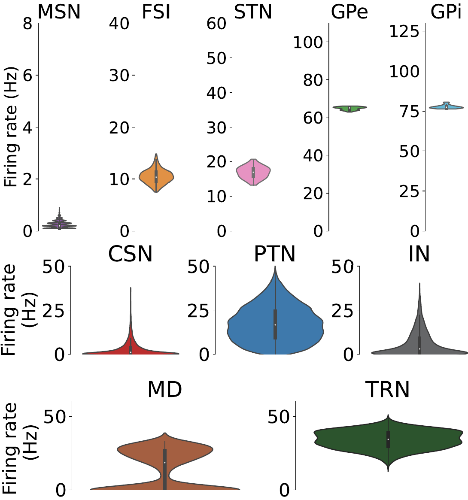

========================================
Simulate CBGTC and get data for analysis
========================================

The CBGTC Model is `available here <https://gitlab.isir.upmc.fr/cobathaco-catatonia/CBGTC>`_ with the accompanying `Jeanne Barthelemy's thesis <https://theses.hal.science/tel-05375201v1/file/144400_BARTHELEMY_2025_archivage.pdf>`_.

.. image:: /images/CBGTC_model.png
   :scale: 50 %
   :alt: CBGTC
   :align: center

Regardless of how one sets up the simulation, to use this analyseaur tool

Example simulation pipeline
===========================

1. Get (Go to) the model
------------------------

Get the model that has been prepared of graded disinhibition (*testinhib* branch)

..  code-block:: shell

    git clone ssh://git@gitlab.isir.lan:2222/cobathaco-catatonia/CBGTC.git
    cd CBGTC

2. Create a shell script for batch run
--------------------------------------

..  code-block:: shell
    :caption: myRun.sh

    #!/bin/sh

    cut_BG=False # keep the connection
    build_new_connection_map=True

    decay_list=(0 0.10 0.15 0.20 0.25 0.30 0.35 0.40 0.45 0.50)

    sCSN_number=1
    ffCSN_number=1
    ffPTN_number=0.1
    sMD_PTN_number=0.1
    sIN_PTN_number=0.9
    sCSN_PTN_number=7.0
    sPTN_number=0.1

    mkdir -p /home/share/data1_recorded
    sim_id=0
    for decay in "${decay_list[@]}"; do
        if [ $sim_id -ne 0 ]; then
            build_new_connection_map=False
        fi

        decayBG_number=$(printf "%s" "$decay")
        echo -e "sCSN=${sCSN_number}\nffCSN=${ffCSN_number}\ndecayBG=${decayBG_number}" > decay_params.py
        echo -e "\ncut_BG=${cut_BG}\nsMD_PTN=${sMD_PTN_number}\nsIN_PTN=${sIN_PTN_number}" >> decay_params.py
        echo -e "\nffPTN=${ffPTN_number}\nsCSN_PTN=${sCSN_PTN_number}\nsPTN=${sPTN_number}" >> decay_params.py
        echo "Running simulation id $sim_id for ffCSN $ff with decayBG $decay"
        python mymainCBGTC.py -i $sim_id -b $build_new_connection_map
        wait
        echo "Done running simulation id $sim_id for (sPTN, ffPTN) = ( ${sPTN_number} , ${ffPTN_number} )with decayBG $decay"
        echo "\nand (sMD_PTN, sCSN_PTN, sIN_PTN) = ( ${sMD_PTN_number} , ${sCSN_PTN_number} , ${sIN_PTN_number} )"
        cp -r DataAnalysis/records/recordedData/model_9/ /home/share/data1_recorded/model_9_sim$sim_id
        cp -r DataAnalysis/records/recordedData/model_9_cortex/ /home/share/data1_recorded/model_9_cortex_sim$sim_id
        cp -r DataAnalysis/records/recordedData/model_9_thalamus/ /home/share/data1_recorded/model_9_thalamus_sim$sim_id
        ((sim_id++))
    done

    mv Studies/current_study/ /home/share/data1/
    mv DataAnalysis/records/*.csv /home/share/data1/
    cp -r BASAL_GANGLIA/connection_lists/ /home/share/data1/BG/
    cp -r CORTEX/connection_lists/ /home/share/data1/CORTEX/
    cp -r THALAMUS/connection_lists/ /home/share/data1/THALAMUS/

Structure of stored results
===========================

Wherever you have directed the simulation results (in the shell script above) to be saved in, for *N* simulations the results sub-folder structure will look like

.. code-block:: text

    .
    ├── BG/
    │   ├── connection_list/
    │   │   ├── scale=4_nbchannels=4/
    │   │   │   └── model_9/
    │   │   └── active_cortex_inputs_scale=4_nbchannels=4/
    │   │       └── model_9/
    │   ├── 1/
    │   ├── 2/
    │   ├── ...
    │   └── N/
    ├── CORTEX/
    │   ├── connection_list/
    │   │   ├── Thalamus_inputs_nbpops=4/
    │   │   └── nbpops=4/
    │   ├── 1/
    │   ├── 2/
    │   ├── ...
    │   └── N/
    ├── THALAMUS/
    │   ├── connection_list/
    │   │   ├── nbpops=4/
    │   │   ├── BG_inputs_nbpops=4/
    │   │   └── active_cortex_inputs_nbpops=4/
    │   ├── 1/
    │   ├── 2/
    │   ├── ...
    │   └── N/
    ├── data_recorded/
    │   ├── model_9_sim1/
    │   ├── model_9_sim2/
    │   ├── ...
    │   ├── model_9_simN/
    │   ├── model_9_cortex_sim1/
    │   ├── model_9_cortex_sim2/
    │   ├── ...
    │   ├── model_9_cortex_simN/
    │   ├── model_9_thalamus_sim1/
    │   ├── model_9_thalamus_sim2/
    │   ├── ...
    │   └── model_9_thalamus_simN/
    ├── BV_results.csv
    ├── CortexResult.csv
    └── rates_per_channel_4_channels.csv

where

* terminal folders in `connection_list/` contains files `connection_lists_i.dat` and `connection_lists_j.dat`
* respective terminal folder `1/`, `2/`, ..., `N/` contains many csv files that stores respective raw data.

    * These are absolutely raw data. For example, spike times a each sampling during the course of the simulation.

* terminal folders in `data_recorded/` also contains many csv files that stores respective raw data.

    * Although these are also raw data the csv's contains data returned by `Brian 2 <https://brian2.readthedocs.io/en/stable/>`_ computation. For example this has firing rate computed as each sampling during the course of the simulation.

Additional Remarks
==================

* When running batch runs it is advisable to run the very first simulation with the option `build_new_connection_map=True`

    * creating new connections is compute intensive
    * but doing this for only the first run will make sure you are running the desired connection configuration
    * otherwise you risk running simulations for the previously stored connection setup

* While setting up the model for experiments make sure that at baseline the nuclei has the baseline frequencies as shown below.

